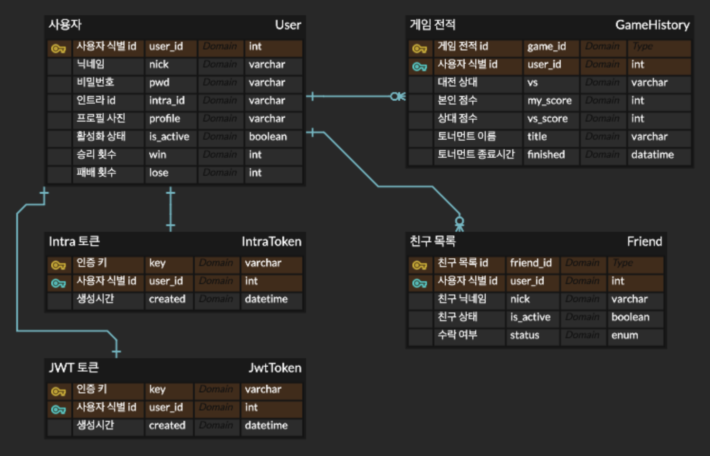

# Transendence

[1. Description](#description)  
[2. Team](#team)  
[3. DB ERD](#db-erd)  
[4. PAGE](#page)  
[5. Commit Convention](#commit-convention)  

### Description
Play Pong with others!  
Our website provides a nice user interface and real-time multiplayer online games.

### Team
[Link to Notion](https://www.notion.so/42seoul8/ft_transcendence-fa1eec1e48d84806ac687065c5f3ba9c?pvs=4)  
#### Frontend
<table>
  <tbody>
    <tr>
      <td align="center"><a href="https://github.com/PHJoon"> <b>박형준</b></a> </td>
      <td align="center"><a href="https://github.com/hyobb109"> <b>조효빈</b></a> </td>
      <td align="center"><a href="https://github.com/sungwook"> <b>김성욱</b></a> </td>
    </tr>
  </tbody>
</table>  

#### Backend
<table>
  <tbody>
    <tr>
      <td align="center"><a href="https://github.com/subillie"> <b>이수빈</b></a> </td>
      <td align="center"><a href="https://github.com/inwoo0115"> <b>이원진</b></a> </td>
    </tr>
  </tbody>
</table>  

### DB ERD
  

### PAGE
<table>
  <tbody align="center">
    <tr>
      <td> 로그인</td>
    </tr>
    <tr>
      <td>
        
       회원가입
      </td>
    </tr>
    <tr>
      <td>
        
         
        이메일 인증 2FA
      </td>
    </tr>
    <tr>
      <td>
        
         
        인증코드 모달
      </td>
    </tr>
    <tr>
      <td>
        
         
        메인
      </td>
    </tr>
    <tr>
      <td>
      
         
        게임메인
      </td>
    </tr>
    <tr>
      <td>
        
         
        프로필
      </td>
    </tr>
    <tr>
      <td>
        
         
        프로필 수정
      </td>
    </tr>
    <tr>
      <td>
        
         
        친구
      </td>
    </tr>
    <tr>
      <td>
        
         
        친구추가
      </td>
    </tr>
    <tr>
      <td>
        
         
        친구요청 수락/거절
      </td>
    </tr>
    <tr>
      <td>
        
         
        친구 전적 확인
      </td>
    </tr>
    <tr>
      <td>
        
         
        게임 설명서
      </td>
    </tr>
    <tr>
      <td>
        
         
        게임 생성
      </td>
    </tr>
    <tr>
      <td>
        
         
        게임 대기방 목록
      </td>
    </tr>
    <tr>
      <td>
        
         
        게임 대기방
      </td>
    </tr>
    <tr>
      <td>
        
         
        게임 대기방 정보
      </td>
    </tr>
    <tr>
      <td>
        
         
        멀티 게임 - 마우스
      </td>
    </tr>
    <tr>
      <td>
        
        
         
        게임 결과
      </td>
    </tr>
    <tr>
      <td>
        
         
        로컬 게임 - 키보드
      </td>
    </tr>
  </tbody>
</table>

### Commit Convention
|Tag Name|Description|
|:---:|:---:|
|Feat|새로운 기능을 추가|
|Fix|버그 수정|
|Design|CSS 등 사용자 UI 디자인 변경|
|!BREAKING CHANGE|커다란 API 변경의 경우|
|!HOTFIX|급하게 치명적인 버그를 고쳐야하는 경우|
|Style|코드 포맷 변경, 세미 콜론 누락, 코드 수정이 없는 경우|
|Refactor|프로덕션 코드 리팩토링|
|Comment|필요한 주석 추가 및 변경|
|Docs|문서 수정|
|Test|테스트 코드, 리펙토링 테스트 코드 추가, Production Code(실제로 사용하는 코드) 변경 없음|
|Chore|빌드 업무 수정, 패키지 매니저 수정, 패키지 관리자 구성 등 업데이트, Production Code 변경 없음|
|Rename|파일 혹은 폴더명을 수정하거나 옮기는 작업만인 경우|
|Remove|파일을 삭제하는 작업만 수행한 경우|  
